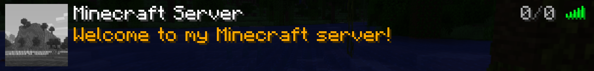

# Minestom4fun 0.1.x

This file documents the evolution of Minestom4fun during the 0.1.x series.

## 0.1.0 - 2026-1-27
- First release
## 0.1.1 - 2026-1-28
### Commands
  - Add /version command
### World
  - #### Generator
    - Renamed overworld.kt to OverworldGenerator.kt
## 0.1.2 - 2026-1-31
### Commands
  - Add /tps command
    
### Network
  - #### Status
    - Add ServerListPing.kt 
        
### Text
  - #### Prefix
    - Add **commands** and **event** folder
    - Add **defaults** folder in **commands** folder
    - Add **player** folder in **event** folder
    - Add DefaultCommandPrefix.kt in **commands/defaults** folder
    - Add PlayerEventPrefix.kt in **event/player** folder
### World
  - #### Generator
    - Add **SuperFlatGenerator** folder
    - Add Layer.kt, SuperFlatGenerator.kt, SuperFlatPreset.kt in **SuperFlatGenerator** foler
    
    - Add **preset** folder
    - Add BottomlessPit.kt, ClassicFlat.kt, SnowyKingdom.kt in **preset** folder